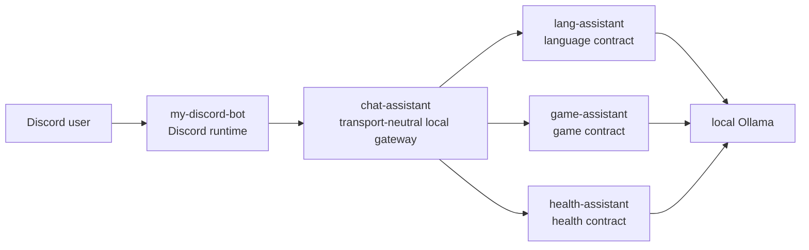

# Ecosystem Architecture

This document is the authoritative MVP ownership boundary for the local AI
assistant ecosystem:

- [Dyu20705/my-discord-bot](https://github.com/Dyu20705/my-discord-bot)
- [Dyu20705/chat-assistant](https://github.com/Dyu20705/chat-assistant)
- [Dyu20705/lang-assistant](https://github.com/Dyu20705/lang-assistant)
- [Dyu20705/game-assistant](https://github.com/Dyu20705/game-assistant)
- [Dyu20705/health-assistant](https://github.com/Dyu20705/health-assistant)

It defines repository ownership, dependency direction, data boundaries, failure
boundaries, capability semantics, and dependencies that are forbidden for the
MVP. It does not freeze a wire schema, select an integration transport,
initialize a Python package, authorize a capability, or implement runtime
behavior.

## Context and MVP Goals

The ecosystem connects Discord users to local assistant capabilities without
turning every repository into a Discord bot or copying domain logic between
projects.

MVP dependency direction:

```text
Discord user
  -> my-discord-bot
  -> chat-assistant
  -> lang-assistant, game-assistant, or health-assistant
  -> local Ollama
```

MVP goals:

- `my-discord-bot` remains the only Discord runtime and Discord token owner.
- `chat-assistant` becomes a transport-neutral local AI gateway.
- `lang-assistant`, `game-assistant`, and `health-assistant` remain independently
  usable without Discord.
- Health support is fail-closed, disabled by default, and cannot be emulated by
  generic chat.
- Cross-repository access happens only through reviewed, versioned public
  contracts.
- A contributor can place a proposed feature in exactly one repository before
  implementation starts.

## Repository Responsibility Matrix

| Responsibility | Owner | Boundary rule |
| --- | --- | --- |
| Discord gateway connection and bot token | `my-discord-bot` | No other repository opens a Discord connection or requires a Discord token. |
| Slash-command registration and canonical Discord command names | `my-discord-bot` | Gateway and assistants expose capabilities, not Discord command names. |
| Discord user, guild, channel authorization, allowlists, and cooldowns | `my-discord-bot` | Checks happen before gateway invocation. |
| Discord interaction acknowledgement, embeds, pagination, attachments, ephemeral responses, and message limits | `my-discord-bot` | Discord presentation does not leak into assistant contracts. |
| Translation from Discord input to transport-neutral gateway request | `my-discord-bot` | The request includes minimized caller context, not raw Discord interaction objects. |
| Translation from gateway result to Discord response | `my-discord-bot` | User-facing Discord wording and visibility stay bot-owned. |
| Local AI gateway and orchestration | `chat-assistant` | The gateway coordinates capabilities and dependencies, but does not own domain behavior. |
| Capability discovery and routing | `chat-assistant` | Capabilities are addressed through the approved protocol, not command names or private modules. |
| Public consumer boundary for `my-discord-bot` | `chat-assistant` | The boundary is transport-neutral and versioned once issue #3 is completed. |
| Assistant adapters | `chat-assistant` | Adapters call public assistant contracts only. |
| Request IDs, correlation, dependency health, timeouts, cancellation, concurrency, and back-pressure | `chat-assistant` | The gateway owns local orchestration metadata and stable gateway errors. |
| Preservation of structured specialist results | `chat-assistant` | The gateway validates envelopes and preserves domain-owned risk, emergency, provenance, disclaimer, and safety fields without free-form reinterpretation. |
| Cross-repository compatibility testing | `chat-assistant` | Tests use contracts, fixtures, or fakes; they do not require Discord, Ollama, or direct databases. |
| Generic Ollama chat | Deferred | Allowed only if separately approved and kept distinct from language, game, and health capabilities. It never serves as a specialist fallback. |
| Learner profiles and language progress | `lang-assistant` | No other repository reads or writes language persistence directly. |
| English and Japanese missions, corrections, retries, mistake history, prompts, validation, planning, and persistence | `lang-assistant` | Language behavior is exposed through a Discord-independent application-service contract. |
| Player profiles and game progress | `game-assistant` | No other repository reads or writes game persistence directly. |
| Game result/replay intake, analysis, weakness diagnosis, map recommendations, training plans, prompts, validation, persistence, and coach-only safety rules | `game-assistant` | Game behavior is exposed through a Discord-independent application-service contract. |
| Health intended use, prohibited uses, claims, hazards, and safety policy | `health-assistant` | No gateway, bot, or generic capability widens, overrides, or reimplements the approved health boundary. |
| Health intake, risk and emergency classification, escalation, evidence retrieval, uncertainty, sources, disclaimers, prompts, model calls, and post-generation validation | `health-assistant` | Health behavior is exposed only through its reviewed Discord-independent application-service contract. |
| Health profiles, consent, records, retention, export, deletion, and health audit data | `health-assistant` | No other repository reads, writes, infers, or caches private health records directly. |

## Capability Taxonomy and Authorization Defaults

Issue #3 owns the eventual stable wire identifiers. This table fixes ownership
and authorization semantics without pre-empting that protocol decision.

| Capability family | Domain owner | Gateway behavior | Default authorization |
| --- | --- | --- | --- |
| Generic advisor chat | `chat-assistant` only if separately approved | Routes only to an approved generic provider and never impersonates a specialist. | Disabled until its own scope and policy are approved. |
| Language coaching | `lang-assistant` | Routes to the public language contract and preserves language-domain results. | Denied unless caller context grants the capability. |
| Game coaching | `game-assistant` | Routes to the public game contract and preserves game-domain results. | Denied unless caller context grants the capability. |
| Health support | `health-assistant` | Routes only to the reviewed health contract; no generic fallback, silent downgrade, or free-form reinterpretation. | Disabled and denied until health safety/privacy gates and caller authorization are approved. |

Discovery is not authorization. Advertising that a capability exists or that a
dependency is healthy never grants a caller permission to invoke it.

## Required Health Protocol Semantics and Fixtures

Issue #3 must define machine-checkable protocol fields and fixtures. Issue #24
requires that the resulting contract preserve the following semantics end to
end. The labels below are semantic requirements, not frozen JSON key syntax:

| Required semantic | Owner and invariant |
| --- | --- |
| Risk level | `health-assistant` classifies ordinary, urgent, emergency, or unknown risk. Gateway and bot must not infer or downgrade it from prose. |
| Emergency state and escalation | `health-assistant` returns an explicit emergency/escalation state plus required action metadata. Missing mandatory emergency fields is an incompatible/invalid result, never an ordinary response. |
| Uncertainty | `health-assistant` returns structured uncertainty or insufficiency when support cannot be safely grounded. |
| Sources and provenance | `health-assistant` returns reviewed source references and provenance allowed by its public contract. Gateway preserves them without querying the private source registry. |
| Disclaimer | `health-assistant` supplies the required domain disclaimer. Consumers may format it but must not remove or weaken it. |
| Safe refusal or error | `health-assistant` owns safety refusals and domain-invalid results; `chat-assistant` owns transport-safe unauthorized, incompatible, busy, timeout, cancellation, unavailable, and internal errors. Neither exposes prompts, health content, stack traces, model hosts, or private dependency details. |

Protocol fixtures must cover at least ordinary, urgent, emergency, unknown-risk,
safety-refusal, invalid-input, unauthorized, unavailable, timeout, cancellation,
and incompatible-version cases. Every urgent and emergency fixture must carry
its risk and emergency semantics, required escalation data, disclaimer, and
allowed provenance through the assistant, gateway, and consumer boundaries.
Free-form text snapshots alone are not contract fixtures.

## Dependency Direction and Request Flow



Request flow:

1. `my-discord-bot` receives the Discord interaction, acknowledges it, validates
   Discord permissions, validates Discord attachments, and applies Discord-facing
   cooldowns.
2. `my-discord-bot` builds a transport-neutral gateway request with minimized
   caller context, capability, operation, structured inputs, optional
   gateway-owned attachment references, and a deadline. Health attachment
   references remain unsupported until a separate safety, privacy, retention,
   and staging gate approves them.
3. `chat-assistant` validates the caller context and request envelope, assigns or
   propagates a request ID, checks capability health, applies concurrency and
   back-pressure, and routes to the selected assistant adapter.
4. The adapter calls the selected assistant through its public
   Discord-independent application-service contract.
5. The assistant owns domain validation, domain behavior, persistence, and its
   own Ollama usage. For health requests, this includes intended-use checks,
   consent, evidence, risk/emergency classification, and post-generation safety
   validation.
6. The assistant returns structured success or stable error information to
   `chat-assistant`.
7. `chat-assistant` maps dependency failures and assistant errors into
   transport-safe gateway results. It preserves domain-owned structured fields
   and rejects incompatible results rather than reconstructing them from text.
8. `my-discord-bot` maps the final gateway result into the Discord response,
   including visibility, embeds, pagination, and user-facing wording.

## Data Ownership and Retention

| Data | Owner | Retention and access rule |
| --- | --- | --- |
| Discord token and Discord client configuration | `my-discord-bot` | Stored only in the bot runtime environment; never sent to the gateway or assistants. |
| Discord command definitions, guild/channel settings, allowlists, cooldown state, and interaction metadata | `my-discord-bot` | Retained according to bot policy; only minimized caller context crosses the gateway boundary. |
| Discord message rendering state, embeds, pagination state, and ephemeral/public response decisions | `my-discord-bot` | Bot-owned presentation data; not persisted by the gateway unless represented as operational metadata. |
| Temporary Discord attachment download and validation state | `my-discord-bot` initially, then `chat-assistant` for gateway-owned references | Bot validates Discord attachment policy before invocation. Gateway references are opaque, scoped to a request/job, and deleted by the layer that created the temporary copy. |
| Gateway request IDs, correlation IDs, deadlines, dependency health, back-pressure state, and temporary job metadata | `chat-assistant` | Operational metadata only; raw learner, player, and health content is excluded from default logs. Temporary metadata expires by gateway policy. |
| Gateway logs and metrics | `chat-assistant` | Metadata is separated from user content. Secrets, stack traces, raw prompts/responses, health content, and personal paths do not enter operational telemetry, readiness, or public errors. Minimized authorized domain payloads cross only reviewed contracts and are not retained by the gateway by default. |
| Learner profiles, language missions, corrections, retries, mistake history, language prompts, and language persistence | `lang-assistant` | Accessed only through the language public contract. No direct database, profile-file, or private-module access by consumers. |
| Player profiles, game results, replay intake data, diagnosis, recommendations, training plans, game prompts, and game persistence | `game-assistant` | Accessed only through the game public contract. No direct database, profile-file, parser-module, or private-module access by consumers. |
| Health profiles, symptoms, medication statements, allergies, observations, consent, prompts, responses, and health persistence | `health-assistant` | Accessed only through approved health operations. No gateway/bot database access, silent model mutation, cross-user access, or unapproved caching. |
| Health source registry, evidence provenance, risk/emergency classifications, disclaimers, safety refusals, and health audit records | `health-assistant` | The public contract exposes only reviewed result metadata. Private source-registry internals, prompts, and records remain health-owned. |
| Local Ollama model configuration and model runtime state | Assistant repository using Ollama, or `chat-assistant` only for separately approved generic chat | Domain assistants own domain model calls. Generic gateway chat is deferred. |

## Allowed Public Integration Boundaries

| Boundary | Allowed integration | Not allowed |
| --- | --- | --- |
| Discord to `my-discord-bot` | Discord gateway events and slash commands handled by the bot. | A second Discord runtime in `chat-assistant`, `lang-assistant`, `game-assistant`, or `health-assistant`. |
| `my-discord-bot` to `chat-assistant` | Approved transport from issue #2 using the versioned protocol from issue #3. | Raw Discord objects, Discord tokens, human-readable CLI parsing, direct assistant calls that bypass the gateway. |
| `chat-assistant` to `lang-assistant` | Public, machine-readable, Discord-independent language application-service contract from `lang-assistant` issue #62. | Reading language SQLite/profile files, importing private modules, copying prompts, parsing human CLI output. |
| `chat-assistant` to `game-assistant` | Public, machine-readable, Discord-independent game application-service contract from `game-assistant` issue #46. | Reading game SQLite/profile files, importing private parser modules, copying prompts, gameplay automation, parsing human CLI output. |
| `chat-assistant` to `health-assistant` | Reviewed, versioned, machine-readable health application-service contract from `health-assistant` issue #21 after its safety/privacy blockers pass. | Reading health records or databases, importing private modules, copying prompts/rules/evidence, exposing private readiness details, or using generic chat as fallback. |
| Assistants to local Ollama | Assistant-owned model calls for domain behavior. | Gateway-owned duplication of domain prompts or assistant planning algorithms. |

## Failure Boundaries and Error Propagation

| Failure | Owning layer | Propagation rule | Discord response owner |
| --- | --- | --- | --- |
| Unauthorized Discord user, guild, channel, command, or attachment policy | `my-discord-bot` | Fail before gateway invocation. | `my-discord-bot` |
| Missing or invalid transport-neutral caller context | `chat-assistant` | Fail closed with a stable authorization error. | `my-discord-bot` |
| Unsupported capability or operation | `chat-assistant` | Return transport-safe unsupported-capability or unsupported-operation error. | `my-discord-bot` |
| Gateway overloaded, busy, or dependency unhealthy | `chat-assistant` | Return stable retryable or non-retryable gateway error with no stack trace. | `my-discord-bot` |
| Assistant process or public contract unavailable | `chat-assistant` | Return stable provider-unavailable error and record operational metadata. | `my-discord-bot` |
| Language invalid input, rejected answer, or domain validation failure | `lang-assistant` | Return stable language-domain error through its public contract. | `my-discord-bot` |
| Game invalid input, insufficient evidence, rejected replay/result, or safety refusal | `game-assistant` | Return stable game-domain error through its public contract. | `my-discord-bot` |
| Health invalid input, prohibited use, insufficient evidence, or safety refusal | `health-assistant` | Return a structured health-domain refusal/error with required safe presentation metadata. Gateway preserves it without generic fallback. | `my-discord-bot` |
| Health urgent or emergency classification | `health-assistant` | Return mandatory structured risk, emergency/escalation, disclaimer, and allowed provenance fields. Gateway preserves them; bot renders the approved urgent presentation. | `my-discord-bot` |
| Health source unavailable, stale, withdrawn, or conflicting | `health-assistant` | Refuse or return structured insufficiency under the approved evidence policy; do not generate an ungrounded replacement. | `my-discord-bot` |
| Ollama unavailable during language coaching | `lang-assistant` | Return stable unavailable error through the language contract. | `my-discord-bot` |
| Ollama unavailable during game coaching | `game-assistant` | Return stable unavailable error through the game contract. | `my-discord-bot` |
| Ollama unavailable during health support | `health-assistant` | Apply health-owned failure policy and return a structured safe unavailable/refusal result without unsupported reassurance. | `my-discord-bot` |
| Request timeout or cancellation before assistant invocation | `chat-assistant` | Stop queued/running gateway work and return timeout or cancellation acknowledgement. | `my-discord-bot` |
| Request timeout or cancellation during assistant work | `chat-assistant` coordinates; selected assistant cooperates | Gateway propagates cancellation through the public contract when supported and cleans gateway-owned temporary data. | `my-discord-bot` |
| Internal exception in any non-Discord layer | Layer where it occurs | Log safe operational metadata locally and return a transport-safe internal error. | `my-discord-bot` |
| Discord message send, edit, pagination, or ephemeral response failure | `my-discord-bot` | Does not change assistant state except through an explicit follow-up operation. | `my-discord-bot` |

## Security and Privacy Boundaries

- Only `my-discord-bot` owns the Discord token.
- Discord permission checks happen before gateway invocation.
- `chat-assistant` validates transport-neutral caller context and fails closed
  when context is missing, malformed, expired, or unauthorized by gateway policy.
- Secrets, tokens, personal machine paths, and internal stack traces never cross
  public contracts.
- Raw learner, player, and health content is excluded from default operational
  logs; health data uses stricter retention and redaction defaults.
- Operational metadata is separated from user content.
- Temporary attachment ownership is explicit: the bot owns Discord download and
  Discord policy validation; the gateway owns any opaque temporary reference it
  creates for assistant invocation; the creating layer deletes its temporary
  copy on completion, timeout, cancellation, or rejection.
- No repository can access another user's private records through direct storage
  access.
- Assistant contracts must authorize access to private learner, player, or
  health records and must reject cross-user access.
- Admin or owner permissions in Discord are not a shortcut for reading private
  learner, player, or health content.
- Health consent is domain data owned by `health-assistant`; Discord or gateway
  authorization does not imply consent to store or mutate health records.
- Public contracts expose stable error codes and safe user-facing messages, not
  exception details.

## Forbidden Dependencies

The MVP forbids:

- A second Discord gateway connection outside `my-discord-bot`.
- A Discord token in `chat-assistant`, `lang-assistant`, `game-assistant`, or
  `health-assistant`.
- Direct access to another repository's SQLite database, profile files, cache
  files, or migrations.
- Imports of private modules from another repository.
- Copying game, language, or health prompts, rules, evidence, validation,
  planning, schemas, algorithms, or persistence code into `chat-assistant`.
- Reclassifying, dropping, weakening, or rebuilding health risk, emergency,
  escalation, provenance, uncertainty, disclaimer, or safety fields from
  free-form text.
- Falling back from a failed, disabled, unauthorized, or incompatible health
  capability to generic chat or another specialist.
- Accepting health attachments or health attachment references before a separate
  safety, privacy, retention, cleanup, and staging review explicitly approves
  them.
- Exposing a health model host, prompt, private source registry, raw health
  content, private record, or internal dependency detail through readiness,
  discovery, logs, or transport-safe errors.
- Parsing human-readable CLI output, ANSI output, or formatted Discord messages
  as a machine contract.
- Assuming repositories are checked out beside each other.
- Hard-coded Windows, Linux, or personal user paths.
- Shared mutable storage across repositories.
- Arbitrary command execution selected by a caller.
- Discord classes or raw Discord interaction objects in assistant contracts.
- Assistant database schemas in gateway or bot contracts.
- Premature extraction of a shared Ollama package before a reviewed common
  contract exists.
- Implementing future behavior merely to illustrate the architecture.

## Existing AI-Like Command Migration and Delegation Notes

The current public `chat-assistant` default branch still includes a legacy
`bot.py` runtime that opens a Discord connection, reads `DISCORD_TOKEN`, and
calls Ollama directly. This conflicts with the target MVP architecture and
requires later migration; this documentation PR does not modify or remove that
runtime behavior.

The current `chat-assistant` command names observed locally include `ask`,
`codeai`, `studyai`, `planai`, `criticai`, `summarizeai`, `fileai`, `resetai`,
`personaai`, `pingai`, `modelai`, and `helpai`. Future implementation work must
not register duplicate commands in both `my-discord-bot` and `chat-assistant`.

`my-discord-bot` already has public study companion design notes for lightweight
study logs, daily and weekly review, vocabulary quizzes, lecturer-style
explanation, Socratic Q&A, and resource suggestions. Those bot-owned features
remain in `my-discord-bot` unless a later issue explicitly delegates advanced
language or game coaching to the gateway. These study features are not approved
health support and must not be presented as such.

Migration policy:

- Discord command names, slash-command registration, permissions, cooldowns,
  response visibility, and message formatting stay in `my-discord-bot`.
- Lightweight local/template study features may remain in `my-discord-bot`.
- Advanced English/Japanese coaching, missions, corrections, retries, mistake
  history, and learner progress delegate through `chat-assistant` to
  `lang-assistant`.
- Game result/replay intake, evidence-based game coaching, weakness diagnosis,
  map recommendations, and training plans delegate through `chat-assistant` to
  `game-assistant`.
- Any approved health-support command delegates through `chat-assistant` to
  `health-assistant`. It remains absent or visibly disabled until the health
  intended-use, hazard, evidence, privacy, contract, authorization, and release
  gates pass.
- Existing generic, study, or lecturer commands must not answer health requests
  as a fallback or silently route them outside the approved health contract.
- Generic AI chat or file analysis is not automatically approved for the
  gateway. It requires a separate decision that keeps it distinct from
  assistant-owned coaching.
- Existing commands may be renamed, split, feature-flagged, or delegated only
  after the topology, protocol, and bot consumer boundary issues are approved.

## Health Readiness and Dependency Reporting

Health readiness is operational metadata, not health advice, authorization, or
proof that safety gates passed. The public health dependency report may expose
only:

- logical capability family and supported public-contract version range;
- one bounded state such as `disabled`, `ready`, `degraded`, or `unavailable`;
- a stable safe reason code, whether retry may be appropriate, and a check time;
- which public gate category remains incomplete, without private issue content
  or user data.

`health-assistant` owns its internal dependency checks. `chat-assistant` may
aggregate the safe public state and map unavailable/incompatible results, but it
must not expose model hostnames, ports, model names, prompts, source-registry
contents, health records, raw exceptions, or health request/response content.
Missing, malformed, stale, or incompatible readiness information fails closed.

The health capability reports `disabled` until the approved intended-use,
hazard, evidence, privacy, application-service contract, gateway protocol,
identity/authorization, QA, and release gates say otherwise. A `ready` technical
dependency cannot override a disabled policy state.

## Migration and Compatibility Consequences

- All health runtime and cross-repository integration implementation remains
  blocked until `chat-assistant` issues #2, #3, and #4 and the applicable
  `health-assistant` issues #1-#4 and #21 receive their required human approvals.
- The canonical gateway repository name is `chat-assistant`. Historical
  `ollama-discord` and `ollama-assistant` URLs are redirect aliases, not separate
  architecture nodes.
- Issue #1 remains the provenance for the original four-repository boundary;
  issue #24 extends that boundary to five repositories without reversing any
  accepted dependency direction.
- Adding health is an additive, opt-in capability. Existing consumers that do
  not know the health capability continue to use language/game behavior. An
  unknown health capability returns unsupported/incompatible, never generic
  advice.
- Issue #2 must apply the selected topology, lifecycle, timeout, and cancellation
  model to the health adapter without inventing a second gateway endpoint.
- Issue #3 must add the health semantics and deterministic fixture matrix defined
  above to the shared versioned protocol. Until then, no adapter may invent a
  private health envelope.
- Issue #4 must approve health-specific identity, authorization, consent,
  logging, retention, export, deletion, and audit policy before enablement.
- `health-assistant` issue #21 owns the public producer contract; issue #18 and
  `chat-assistant` issue #30 own later integration work after all gates pass.
- This architecture change adds no runtime, database, migration, dependency,
  deployment, or public endpoint by itself.

## Scenario Traces

| Scenario | Initial validation | Boundary crossed | Domain owner | Final Discord mapping | Temporary data cleanup | Failure owner |
| --- | --- | --- | --- | --- | --- | --- |
| Request today's language mission | `my-discord-bot` checks Discord auth, command policy, and cooldown. `chat-assistant` validates caller context. | Bot to gateway, then gateway to language contract. | `lang-assistant` retrieves or generates the mission. | `my-discord-bot` formats the mission as an ephemeral/public response according to bot policy. | Gateway deletes temporary job metadata; no attachment expected. | Bot for Discord auth; gateway for routing/health; language assistant for domain errors or Ollama errors. |
| Submit a language answer for correction | Bot checks Discord auth, command policy, cooldown, and any Discord attachment policy. Gateway validates caller context and request envelope. | Bot to gateway, then gateway to language contract. | `lang-assistant` validates the answer, performs correction, persists learner progress if its contract allows. | Bot formats correction, pagination, and visibility. | Bot deletes Discord temp download if any; gateway deletes gateway-owned attachment reference/job metadata. | Language assistant owns correction/rejection; gateway owns timeout/cancellation/provider unavailable; bot owns Discord failures. |
| Submit or reference a game result for coaching | Bot validates Discord auth, command policy, attachment size/type/source, and cooldown. Gateway validates caller context and opaque attachment reference. | Bot to gateway, then gateway to game contract. | `game-assistant` owns intake, evidence validation, analysis, diagnosis, recommendations, and safety refusal. | Bot maps review or safe refusal into Discord presentation. | Bot deletes Discord-side temporary file; gateway deletes opaque temporary reference; game assistant follows its own retention policy for accepted records. | Game assistant owns invalid evidence/safety/domain errors; gateway owns provider health and cancellation; bot owns Discord attachment rejection. |
| Request approved ordinary health support | Bot checks Discord authorization and command policy. Gateway separately validates transport-neutral health capability authorization and policy state. | Bot to gateway, then gateway to reviewed health contract. | `health-assistant` validates intended use and consent, grounds the response, classifies risk, validates output, and returns structured sources/disclaimer. | Bot renders the structured result and mandatory disclaimer under approved visibility rules without changing risk or provenance. | Each layer deletes temporary data it created; health retention occurs only under the approved consent/persistence policy. | Bot owns Discord authorization; gateway owns routing/policy/transport; health assistant owns health safety, evidence, and model failures. |
| Health request classified urgent or emergency | Bot and gateway perform the same fail-closed authorization checks. | Bot to gateway, then gateway to health contract. | `health-assistant` owns risk/emergency classification and required escalation metadata. | Gateway preserves mandatory fields; bot renders the approved urgent/emergency presentation without truncation, reinterpretation, or generic fallback. | Temporary data cleanup still runs; urgency does not authorize new persistence. | Health assistant owns classification; gateway owns contract validity; bot owns Discord delivery. |
| Health dependency unavailable or disabled | Bot validates the request; gateway sees disabled policy or safe unavailable/incompatible readiness. | Bot to gateway only, or gateway to failed health boundary. | No generic or other specialist domain executes. | Bot sends a safe unavailable/disabled response; it does not provide substitute health advice. | Gateway clears queued job metadata and opaque references; bot clears Discord-side temporary data. | Gateway owns stable disabled/unavailable mapping; health assistant owns internal dependency failure details. |
| Assistant process unavailable | Bot validates request before gateway call. Gateway detects unavailable contract/provider. | Bot to gateway only, or gateway to failed assistant boundary. | None; domain behavior is not executed. | Bot sends safe unavailable/busy message. | Gateway clears queued job metadata and temporary references it owns. | `chat-assistant` owns dependency health and provider-unavailable error. |
| Ollama unavailable | Bot and gateway validate request. Selected assistant attempts domain operation and detects Ollama failure. | Bot to gateway, gateway to selected assistant. | Selected assistant owns the model dependency for its domain operation. | Bot sends safe unavailable message based on stable error. | Gateway and bot clean temporary data they created; assistant follows its own partial-work policy. | Selected assistant owns Ollama unavailable for domain coaching; gateway only propagates transport-safe error. |
| Request timeout or cancellation | Bot validates Discord request; gateway tracks deadline and cancellation. | Bot to gateway; gateway may also cross assistant boundary. | Selected assistant only owns domain cleanup for work it accepted. | Bot sends timeout or cancellation acknowledgement. | Gateway cancels queued/running work when possible and deletes gateway-owned temporary data. Bot cleans Discord-side temporary data. | Gateway owns orchestration timeout/cancellation; assistant cooperates after invocation. |
| Unauthorized Discord or health-capability request | Bot rejects failed Discord policy before invocation; gateway rejects missing, malformed, expired, or unauthorized caller context and disabled health policy. | None, or bot to gateway only. | None. | Bot sends a safe unauthorized/disabled response with no health record or capability detail. | No assistant data is created; the rejecting layer cleans temporary data it owns. | Bot owns Discord policy; gateway owns transport-neutral capability authorization. |
| Invalid or rejected language/game attachment | Bot rejects Discord-disallowed attachments before gateway invocation. Gateway rejects malformed or expired opaque references. Assistant rejects domain-invalid evidence/content. | Depends on where invalidity is detected. | `lang-assistant` or `game-assistant` only for domain-specific rejection after acceptance by gateway. | Bot maps rejection into safe Discord response. | The layer that created the temporary copy/reference deletes it. | Bot for Discord policy; gateway for reference validity; assistant for domain validation. |
| Health attachment or attachment reference | Bot or gateway rejects it before health invocation because this architecture does not approve health attachments. | None, or bot to gateway only. | None. | Bot returns a safe unsupported-input response and does not substitute generic health advice. | The rejecting layer deletes temporary data it created. | Bot owns Discord attachment policy; gateway owns protocol rejection. |

## Deferred ADRs and Decisions

The following decisions are intentionally deferred:

- Integration transport and deployment topology:
  [Dyu20705/chat-assistant#2](https://github.com/Dyu20705/chat-assistant/issues/2)
- Versioned capability protocol, schema, fixtures, and compatibility rules:
  [Dyu20705/chat-assistant#3](https://github.com/Dyu20705/chat-assistant/issues/3)
- Identity, authorization, privacy, retention, raw prompt/response persistence,
  delete/export, and role mapping policy:
  [Dyu20705/chat-assistant#4](https://github.com/Dyu20705/chat-assistant/issues/4)
- Python package layout, entry points, tests, configuration, and deployment files:
  [Dyu20705/chat-assistant#5](https://github.com/Dyu20705/chat-assistant/issues/5)
- Bot consumer boundary, command-to-capability map, feature flags, fallback
  policy, and test doubles:
  [Dyu20705/my-discord-bot#56](https://github.com/Dyu20705/my-discord-bot/issues/56)
- Language assistant public application-service contract:
  [Dyu20705/lang-assistant#62](https://github.com/Dyu20705/lang-assistant/issues/62)
- Game assistant public application-service contract:
  [Dyu20705/game-assistant#46](https://github.com/Dyu20705/game-assistant/issues/46)
- Health intended use, prohibited use, and claims:
  [Dyu20705/health-assistant#1](https://github.com/Dyu20705/health-assistant/issues/1)
- Health hazard ownership and residual-risk approval:
  [Dyu20705/health-assistant#2](https://github.com/Dyu20705/health-assistant/issues/2)
- Health evidence governance and reviewed source policy:
  [Dyu20705/health-assistant#3](https://github.com/Dyu20705/health-assistant/issues/3)
- Health privacy, consent, retention, export, deletion, and threat model:
  [Dyu20705/health-assistant#4](https://github.com/Dyu20705/health-assistant/issues/4)
- Health assistant public application-service contract and deterministic fixtures:
  [Dyu20705/health-assistant#21](https://github.com/Dyu20705/health-assistant/issues/21)
- Cross-repository health integration and enablement:
  [Dyu20705/health-assistant#18](https://github.com/Dyu20705/health-assistant/issues/18)

## Relevant Issues

- [Dyu20705/chat-assistant#1](https://github.com/Dyu20705/chat-assistant/issues/1)
  - Defines the accepted original four-repository ownership boundary.
- [Dyu20705/chat-assistant#24](https://github.com/Dyu20705/chat-assistant/issues/24)
  - Extends the ownership boundary and capability taxonomy to Health Assistant.
- [Dyu20705/chat-assistant#2](https://github.com/Dyu20705/chat-assistant/issues/2)
  - Selects integration transport and topology.
- [Dyu20705/chat-assistant#3](https://github.com/Dyu20705/chat-assistant/issues/3)
  - Defines the versioned capability protocol.
- [Dyu20705/chat-assistant#4](https://github.com/Dyu20705/chat-assistant/issues/4)
  - Defines identity, privacy, authorization, retention, and data ownership.
- [Dyu20705/chat-assistant#5](https://github.com/Dyu20705/chat-assistant/issues/5)
  - Initializes the Python project after architecture and topology approval.
- [Dyu20705/my-discord-bot#56](https://github.com/Dyu20705/my-discord-bot/issues/56)
  - Defines the bot-to-gateway consumer boundary.
- [Dyu20705/lang-assistant#62](https://github.com/Dyu20705/lang-assistant/issues/62)
  - Defines the language assistant public contract.
- [Dyu20705/game-assistant#46](https://github.com/Dyu20705/game-assistant/issues/46)
  - Defines the game assistant public contract.
- [Dyu20705/health-assistant#1](https://github.com/Dyu20705/health-assistant/issues/1),
  [#2](https://github.com/Dyu20705/health-assistant/issues/2),
  [#3](https://github.com/Dyu20705/health-assistant/issues/3), and
  [#4](https://github.com/Dyu20705/health-assistant/issues/4)
  - Define the health intended-use, hazard, evidence, and privacy gates.
- [Dyu20705/health-assistant#21](https://github.com/Dyu20705/health-assistant/issues/21)
  - Defines the Discord-independent health application-service contract.
- [Dyu20705/health-assistant#18](https://github.com/Dyu20705/health-assistant/issues/18)
  - Tracks later cross-repository health integration after all gates pass.
