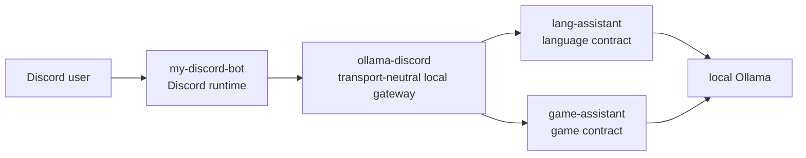

# Ecosystem Architecture

This document is the authoritative MVP ownership boundary for the local AI
assistant ecosystem:

- [Dyu20705/my-discord-bot](https://github.com/Dyu20705/my-discord-bot)
- [Dyu20705/ollama-discord](https://github.com/Dyu20705/ollama-discord)
- [Dyu20705/lang-assistant](https://github.com/Dyu20705/lang-assistant)
- [Dyu20705/game-assistant](https://github.com/Dyu20705/game-assistant)

It defines repository ownership, dependency direction, data boundaries, failure
boundaries, and dependencies that are forbidden for the MVP. It does not define
a wire schema, select an integration transport, initialize a Python package, or
implement runtime behavior.

## Context and MVP Goals

The ecosystem connects Discord users to local assistant capabilities without
turning every repository into a Discord bot or copying domain logic between
projects.

MVP dependency direction:

```text
Discord user
  -> my-discord-bot
  -> ollama-discord
  -> lang-assistant or game-assistant
  -> local Ollama
```

MVP goals:

- `my-discord-bot` remains the only Discord runtime and Discord token owner.
- `ollama-discord` becomes a transport-neutral local AI gateway.
- `lang-assistant` and `game-assistant` remain independently usable without
  Discord.
- Cross-repository access happens only through reviewed, versioned public
  contracts.
- A contributor can place a proposed feature in exactly one repository before
  implementation starts.

## Repository Responsibility Matrix

| Responsibility | Owner | Boundary rule |
| --- | --- | --- |
| Discord gateway connection and bot token | `my-discord-bot` | No other repository opens a Discord connection or requires a Discord token. |
| Slash-command registration and canonical Discord command names | `my-discord-bot` | Gateway and assistants expose capabilities, not Discord command names. |
| Discord user, guild, channel authorization, allowlists, and cooldowns | `my-discord-bot` | Checks happen before gateway invocation. |
| Discord interaction acknowledgement, embeds, pagination, attachments, ephemeral responses, and message limits | `my-discord-bot` | Discord presentation does not leak into assistant contracts. |
| Translation from Discord input to transport-neutral gateway request | `my-discord-bot` | The request includes minimized caller context, not raw Discord interaction objects. |
| Translation from gateway result to Discord response | `my-discord-bot` | User-facing Discord wording and visibility stay bot-owned. |
| Local AI gateway and orchestration | `ollama-discord` | The gateway coordinates capabilities and dependencies, but does not own domain behavior. |
| Capability discovery and routing | `ollama-discord` | Capabilities are addressed through the approved protocol, not command names or private modules. |
| Public consumer boundary for `my-discord-bot` | `ollama-discord` | The boundary is transport-neutral and versioned once issue #3 is completed. |
| Assistant adapters | `ollama-discord` | Adapters call public assistant contracts only. |
| Request IDs, correlation, dependency health, timeouts, cancellation, concurrency, and back-pressure | `ollama-discord` | The gateway owns local orchestration metadata and stable gateway errors. |
| Cross-repository compatibility testing | `ollama-discord` | Tests use contracts, fixtures, or fakes; they do not require Discord, Ollama, or direct databases. |
| Generic Ollama chat | Deferred | Allowed only if separately approved and kept distinct from language/game coaching. |
| Learner profiles and language progress | `lang-assistant` | No other repository reads or writes language persistence directly. |
| English and Japanese missions, corrections, retries, mistake history, prompts, validation, planning, and persistence | `lang-assistant` | Language behavior is exposed through a Discord-independent application-service contract. |
| Player profiles and game progress | `game-assistant` | No other repository reads or writes game persistence directly. |
| Game result/replay intake, analysis, weakness diagnosis, map recommendations, training plans, prompts, validation, persistence, and coach-only safety rules | `game-assistant` | Game behavior is exposed through a Discord-independent application-service contract. |

## Dependency Direction and Request Flow



Request flow:

1. `my-discord-bot` receives the Discord interaction, acknowledges it, validates
   Discord permissions, validates Discord attachments, and applies Discord-facing
   cooldowns.
2. `my-discord-bot` builds a transport-neutral gateway request with minimized
   caller context, capability, operation, structured inputs, optional
   gateway-owned attachment references, and a deadline.
3. `ollama-discord` validates the caller context and request envelope, assigns or
   propagates a request ID, checks capability health, applies concurrency and
   back-pressure, and routes to the selected assistant adapter.
4. The adapter calls the selected assistant through its public
   Discord-independent application-service contract.
5. The assistant owns domain validation, domain behavior, persistence, and its
   own Ollama usage.
6. The assistant returns structured success or stable error information to
   `ollama-discord`.
7. `ollama-discord` maps dependency failures and assistant errors into
   transport-safe gateway results.
8. `my-discord-bot` maps the final gateway result into the Discord response,
   including visibility, embeds, pagination, and user-facing wording.

## Data Ownership and Retention

| Data | Owner | Retention and access rule |
| --- | --- | --- |
| Discord token and Discord client configuration | `my-discord-bot` | Stored only in the bot runtime environment; never sent to the gateway or assistants. |
| Discord command definitions, guild/channel settings, allowlists, cooldown state, and interaction metadata | `my-discord-bot` | Retained according to bot policy; only minimized caller context crosses the gateway boundary. |
| Discord message rendering state, embeds, pagination state, and ephemeral/public response decisions | `my-discord-bot` | Bot-owned presentation data; not persisted by the gateway unless represented as operational metadata. |
| Temporary Discord attachment download and validation state | `my-discord-bot` initially, then `ollama-discord` for gateway-owned references | Bot validates Discord attachment policy before invocation. Gateway references are opaque, scoped to a request/job, and deleted by the layer that created the temporary copy. |
| Gateway request IDs, correlation IDs, deadlines, dependency health, back-pressure state, and temporary job metadata | `ollama-discord` | Operational metadata only; raw learner/player content is excluded from default logs. Temporary metadata expires by gateway policy. |
| Gateway logs and metrics | `ollama-discord` | Metadata is separated from user content. Secrets, stack traces, raw prompts, raw responses, and personal machine paths do not cross public contracts. |
| Learner profiles, language missions, corrections, retries, mistake history, language prompts, and language persistence | `lang-assistant` | Accessed only through the language public contract. No direct database, profile-file, or private-module access by consumers. |
| Player profiles, game results, replay intake data, diagnosis, recommendations, training plans, game prompts, and game persistence | `game-assistant` | Accessed only through the game public contract. No direct database, profile-file, parser-module, or private-module access by consumers. |
| Local Ollama model configuration and model runtime state | Assistant repository using Ollama, or `ollama-discord` only for separately approved generic chat | Domain assistants own domain model calls. Generic gateway chat is deferred. |

## Allowed Public Integration Boundaries

| Boundary | Allowed integration | Not allowed |
| --- | --- | --- |
| Discord to `my-discord-bot` | Discord gateway events and slash commands handled by the bot. | A second Discord runtime in `ollama-discord`, `lang-assistant`, or `game-assistant`. |
| `my-discord-bot` to `ollama-discord` | Approved transport from issue #2 using the versioned protocol from issue #3. | Raw Discord objects, Discord tokens, human-readable CLI parsing, direct assistant calls that bypass the gateway. |
| `ollama-discord` to `lang-assistant` | Public, machine-readable, Discord-independent language application-service contract from `lang-assistant` issue #62. | Reading language SQLite/profile files, importing private modules, copying prompts, parsing human CLI output. |
| `ollama-discord` to `game-assistant` | Public, machine-readable, Discord-independent game application-service contract from `game-assistant` issue #46. | Reading game SQLite/profile files, importing private parser modules, copying prompts, gameplay automation, parsing human CLI output. |
| Assistants to local Ollama | Assistant-owned model calls for domain behavior. | Gateway-owned duplication of domain prompts or assistant planning algorithms. |

## Failure Boundaries and Error Propagation

| Failure | Owning layer | Propagation rule | Discord response owner |
| --- | --- | --- | --- |
| Unauthorized Discord user, guild, channel, command, or attachment policy | `my-discord-bot` | Fail before gateway invocation. | `my-discord-bot` |
| Missing or invalid transport-neutral caller context | `ollama-discord` | Fail closed with a stable authorization error. | `my-discord-bot` |
| Unsupported capability or operation | `ollama-discord` | Return transport-safe unsupported-capability or unsupported-operation error. | `my-discord-bot` |
| Gateway overloaded, busy, or dependency unhealthy | `ollama-discord` | Return stable retryable or non-retryable gateway error with no stack trace. | `my-discord-bot` |
| Assistant process or public contract unavailable | `ollama-discord` | Return stable provider-unavailable error and record operational metadata. | `my-discord-bot` |
| Language invalid input, rejected answer, or domain validation failure | `lang-assistant` | Return stable language-domain error through its public contract. | `my-discord-bot` |
| Game invalid input, insufficient evidence, rejected replay/result, or safety refusal | `game-assistant` | Return stable game-domain error through its public contract. | `my-discord-bot` |
| Ollama unavailable during language coaching | `lang-assistant` | Return stable unavailable error through the language contract. | `my-discord-bot` |
| Ollama unavailable during game coaching | `game-assistant` | Return stable unavailable error through the game contract. | `my-discord-bot` |
| Request timeout or cancellation before assistant invocation | `ollama-discord` | Stop queued/running gateway work and return timeout or cancellation acknowledgement. | `my-discord-bot` |
| Request timeout or cancellation during assistant work | `ollama-discord` coordinates; selected assistant cooperates | Gateway propagates cancellation through the public contract when supported and cleans gateway-owned temporary data. | `my-discord-bot` |
| Internal exception in any non-Discord layer | Layer where it occurs | Log safe operational metadata locally and return a transport-safe internal error. | `my-discord-bot` |
| Discord message send, edit, pagination, or ephemeral response failure | `my-discord-bot` | Does not change assistant state except through an explicit follow-up operation. | `my-discord-bot` |

## Security and Privacy Boundaries

- Only `my-discord-bot` owns the Discord token.
- Discord permission checks happen before gateway invocation.
- `ollama-discord` validates transport-neutral caller context and fails closed
  when context is missing, malformed, expired, or unauthorized by gateway policy.
- Secrets, tokens, personal machine paths, and internal stack traces never cross
  public contracts.
- Raw learner/player content is excluded from default operational logs.
- Operational metadata is separated from user content.
- Temporary attachment ownership is explicit: the bot owns Discord download and
  Discord policy validation; the gateway owns any opaque temporary reference it
  creates for assistant invocation; the creating layer deletes its temporary
  copy on completion, timeout, cancellation, or rejection.
- No repository can access another user's private records through direct storage
  access.
- Assistant contracts must authorize access to private learner/player records
  and must reject cross-user access.
- Admin or owner permissions in Discord are not a shortcut for reading private
  learner/player content.
- Public contracts expose stable error codes and safe user-facing messages, not
  exception details.

## Forbidden Dependencies

The MVP forbids:

- A second Discord gateway connection outside `my-discord-bot`.
- A Discord token in `ollama-discord`, `lang-assistant`, or `game-assistant`.
- Direct access to another repository's SQLite database, profile files, cache
  files, or migrations.
- Imports of private modules from another repository.
- Copying game or language prompts, validation, planning, schemas, algorithms,
  or persistence code into `ollama-discord`.
- Parsing human-readable CLI output, ANSI output, or formatted Discord messages
  as a machine contract.
- Assuming repositories are checked out beside each other.
- Hard-coded Windows, Linux, or personal user paths.
- Shared mutable storage across repositories.
- Arbitrary command execution selected by a caller.
- Discord classes or raw Discord interaction objects in assistant contracts.
- Assistant database schemas in gateway or bot contracts.
- Premature extraction of a shared Ollama package before a reviewed common
  contract exists.
- Implementing future behavior merely to illustrate the architecture.

## Existing AI-Like Command Migration and Delegation Notes

The current public `ollama-discord` default branch still includes a legacy
`bot.py` runtime that opens a Discord connection, reads `DISCORD_TOKEN`, and
calls Ollama directly. This conflicts with the target MVP architecture and
requires later migration; this documentation PR does not modify or remove that
runtime behavior.

The current `ollama-discord` command names observed locally include `ask`,
`codeai`, `studyai`, `planai`, `criticai`, `summarizeai`, `fileai`, `resetai`,
`personaai`, `pingai`, `modelai`, and `helpai`. Future implementation work must
not register duplicate commands in both `my-discord-bot` and `ollama-discord`.

`my-discord-bot` already has public study companion design notes for lightweight
study logs, daily and weekly review, vocabulary quizzes, lecturer-style
explanation, Socratic Q&A, and resource suggestions. Those bot-owned features
remain in `my-discord-bot` unless a later issue explicitly delegates advanced
language or game coaching to the gateway.

Migration policy:

- Discord command names, slash-command registration, permissions, cooldowns,
  response visibility, and message formatting stay in `my-discord-bot`.
- Lightweight local/template study features may remain in `my-discord-bot`.
- Advanced English/Japanese coaching, missions, corrections, retries, mistake
  history, and learner progress delegate through `ollama-discord` to
  `lang-assistant`.
- Game result/replay intake, evidence-based game coaching, weakness diagnosis,
  map recommendations, and training plans delegate through `ollama-discord` to
  `game-assistant`.
- Generic AI chat or file analysis is not automatically approved for the
  gateway. It requires a separate decision that keeps it distinct from
  assistant-owned coaching.
- Existing commands may be renamed, split, feature-flagged, or delegated only
  after the topology, protocol, and bot consumer boundary issues are approved.

## Scenario Traces

| Scenario | Initial validation | Boundary crossed | Domain owner | Final Discord mapping | Temporary data cleanup | Failure owner |
| --- | --- | --- | --- | --- | --- | --- |
| Request today's language mission | `my-discord-bot` checks Discord auth, command policy, and cooldown. `ollama-discord` validates caller context. | Bot to gateway, then gateway to language contract. | `lang-assistant` retrieves or generates the mission. | `my-discord-bot` formats the mission as an ephemeral/public response according to bot policy. | Gateway deletes temporary job metadata; no attachment expected. | Bot for Discord auth; gateway for routing/health; language assistant for domain errors or Ollama errors. |
| Submit a language answer for correction | Bot checks Discord auth, command policy, cooldown, and any Discord attachment policy. Gateway validates caller context and request envelope. | Bot to gateway, then gateway to language contract. | `lang-assistant` validates the answer, performs correction, persists learner progress if its contract allows. | Bot formats correction, pagination, and visibility. | Bot deletes Discord temp download if any; gateway deletes gateway-owned attachment reference/job metadata. | Language assistant owns correction/rejection; gateway owns timeout/cancellation/provider unavailable; bot owns Discord failures. |
| Submit or reference a game result for coaching | Bot validates Discord auth, command policy, attachment size/type/source, and cooldown. Gateway validates caller context and opaque attachment reference. | Bot to gateway, then gateway to game contract. | `game-assistant` owns intake, evidence validation, analysis, diagnosis, recommendations, and safety refusal. | Bot maps review or safe refusal into Discord presentation. | Bot deletes Discord-side temporary file; gateway deletes opaque temporary reference; game assistant follows its own retention policy for accepted records. | Game assistant owns invalid evidence/safety/domain errors; gateway owns provider health and cancellation; bot owns Discord attachment rejection. |
| Assistant process unavailable | Bot validates request before gateway call. Gateway detects unavailable contract/provider. | Bot to gateway only, or gateway to failed assistant boundary. | None; domain behavior is not executed. | Bot sends safe unavailable/busy message. | Gateway clears queued job metadata and temporary references it owns. | `ollama-discord` owns dependency health and provider-unavailable error. |
| Ollama unavailable | Bot and gateway validate request. Selected assistant attempts domain operation and detects Ollama failure. | Bot to gateway, gateway to selected assistant. | Selected assistant owns the model dependency for its domain operation. | Bot sends safe unavailable message based on stable error. | Gateway and bot clean temporary data they created; assistant follows its own partial-work policy. | Selected assistant owns Ollama unavailable for domain coaching; gateway only propagates transport-safe error. |
| Request timeout or cancellation | Bot validates Discord request; gateway tracks deadline and cancellation. | Bot to gateway; gateway may also cross assistant boundary. | Selected assistant only owns domain cleanup for work it accepted. | Bot sends timeout or cancellation acknowledgement. | Gateway cancels queued/running work when possible and deletes gateway-owned temporary data. Bot cleans Discord-side temporary data. | Gateway owns orchestration timeout/cancellation; assistant cooperates after invocation. |
| Unauthorized Discord request | Bot rejects before gateway invocation. | None. | None. | Bot sends safe unauthorized response according to Discord policy. | No gateway data created; bot cleans any rejected temporary attachment. | `my-discord-bot`. |
| Invalid or rejected attachment | Bot rejects Discord-disallowed attachments before gateway invocation. Gateway rejects malformed or expired opaque references. Assistant rejects domain-invalid evidence/content. | Depends on where invalidity is detected. | `lang-assistant` or `game-assistant` only for domain-specific rejection after acceptance by gateway. | Bot maps rejection into safe Discord response. | The layer that created the temporary copy/reference deletes it. | Bot for Discord policy; gateway for reference validity; assistant for domain validation. |

## Deferred ADRs and Decisions

The following decisions are intentionally deferred:

- Integration transport and deployment topology:
  [Dyu20705/ollama-discord#2](https://github.com/Dyu20705/ollama-discord/issues/2)
- Versioned capability protocol, schema, fixtures, and compatibility rules:
  [Dyu20705/ollama-discord#3](https://github.com/Dyu20705/ollama-discord/issues/3)
- Identity, authorization, privacy, retention, raw prompt/response persistence,
  delete/export, and role mapping policy:
  [Dyu20705/ollama-discord#4](https://github.com/Dyu20705/ollama-discord/issues/4)
- Python package layout, entry points, tests, configuration, and deployment files:
  [Dyu20705/ollama-discord#5](https://github.com/Dyu20705/ollama-discord/issues/5)
- Bot consumer boundary, command-to-capability map, feature flags, fallback
  policy, and test doubles:
  [Dyu20705/my-discord-bot#56](https://github.com/Dyu20705/my-discord-bot/issues/56)
- Language assistant public application-service contract:
  [Dyu20705/lang-assistant#62](https://github.com/Dyu20705/lang-assistant/issues/62)
- Game assistant public application-service contract:
  [Dyu20705/game-assistant#46](https://github.com/Dyu20705/game-assistant/issues/46)

## Relevant Issues

- [Dyu20705/ollama-discord#1](https://github.com/Dyu20705/ollama-discord/issues/1)
  - Defines this four-repository ownership boundary.
- [Dyu20705/ollama-discord#2](https://github.com/Dyu20705/ollama-discord/issues/2)
  - Selects integration transport and topology.
- [Dyu20705/ollama-discord#3](https://github.com/Dyu20705/ollama-discord/issues/3)
  - Defines the versioned capability protocol.
- [Dyu20705/ollama-discord#4](https://github.com/Dyu20705/ollama-discord/issues/4)
  - Defines identity, privacy, authorization, retention, and data ownership.
- [Dyu20705/ollama-discord#5](https://github.com/Dyu20705/ollama-discord/issues/5)
  - Initializes the Python project after architecture and topology approval.
- [Dyu20705/my-discord-bot#56](https://github.com/Dyu20705/my-discord-bot/issues/56)
  - Defines the bot-to-gateway consumer boundary.
- [Dyu20705/lang-assistant#62](https://github.com/Dyu20705/lang-assistant/issues/62)
  - Defines the language assistant public contract.
- [Dyu20705/game-assistant#46](https://github.com/Dyu20705/game-assistant/issues/46)
  - Defines the game assistant public contract.
