# Open-Issue Dependency Graph

Snapshot date: 2026-07-15

Scope: all 26 open issues in `Dyu20705/chat-assistant`, plus the direct producer and Discord-consumer issues that gate their acceptance evidence. The snapshot reconciles the checked-in backlog manifests, live issue labels and refinement comments, current source and CI, merged governance PR #35, and explicitly approved architecture PR #36 at reviewed head `235e95ba21c6ae8f4e12afc16ca45ab7a291f47d` and squash commit `52ab23dcd5fd4af4ce216a49d4c4e29641fb60ce`.

Historical `ollama-discord` and `ollama-assistant` URLs resolve to this repository and are rename aliases, not separate systems. Canonical references use `Dyu20705/chat-assistant`.

External `ready-for-agent` labels below are reported verbatim. They do not override the dependency and acceptance blockers recorded in this graph.

The managed backlog manifests are seed/alignment inputs, not the source of truth for later dependency refinements recorded in live issue comments. Volatile `ready-for-agent` labels have been removed from the five local manifest entries whose blockers are tracked dynamically, so an additive synchronization cannot recreate the resolved blocked/ready conflicts.

## Current gate

- Governance, the Phase 0 context baseline, and the accepted five-repository Health Assistant boundary are merged on `main` through PR #36.
- [#37](https://github.com/Dyu20705/chat-assistant/issues/37) is the only local issue labeled `ready-for-agent`, but its work-start comment claims the existing branch, so it is in progress rather than available; it changes no architecture or runtime behavior.
- [#24](https://github.com/Dyu20705/chat-assistant/issues/24) received explicit owner architecture/privacy approval and was closed by merged [PR #36](https://github.com/Dyu20705/chat-assistant/pull/36). Required CI, two independent review axes, and GitHub Codex review were clean at the reviewed head, with no review threads.
- [#2](https://github.com/Dyu20705/chat-assistant/issues/2) still carries `status:blocked` and a pre-merge comment whose only predecessor was #24. That predecessor is now satisfied, but this snapshot does not relabel #2 under the #37 documentation scope.
- After #37, #2 is the next design issue to triage and draft. Its ADR still requires explicit human architecture/security approval before merge. No production implementation issue is currently unblocked.

## Execution graph

| Issue | Type | Depends on | Blocked by current evidence | Responsible repository | Risk | Proposed order/state |
| --- | --- | --- | --- | --- | --- | --- |
| [#37](https://github.com/Dyu20705/chat-assistant/issues/37) Reconcile the Phase 0 graph | Maintenance/docs | None | None; documentation/managed-metadata reconciliation is claimed on its existing branch | `chat-assistant` | Low | Current issue; in progress |
| [#2](https://github.com/Dyu20705/chat-assistant/issues/2) Select transport/topology | Architecture/ADR | Closed/accepted #24; programme ordering keeps #37 first | Live `status:blocked` metadata predates the satisfied #24 gate; ADR drafting is next after #37 and human architecture/security approval is required before merge | `chat-assistant` | Critical | Next after #37; relabel separately |
| [#3](https://github.com/Dyu20705/chat-assistant/issues/3) Versioned capability protocol | Public contract | #2; closed/accepted #24 | Topology is open; human protocol/security/privacy approval required | `chat-assistant`; fixtures consumed by all five repos | Critical | After #2 |
| [#4](https://github.com/Dyu20705/chat-assistant/issues/4) Identity/privacy/data ownership | Security/contract | #2, #3; closed/accepted #24 | Topology and protocol are open; human security/privacy approval required | All five repos; policy recorded in `chat-assistant` | Critical | After #3 |
| [#5](https://github.com/Dyu20705/chat-assistant/issues/5) Remove Discord runtime and initialize gateway package | Refactor/implementation | #2; closed/accepted #24 | Approved topology is absent; current `pyproject.toml`, `bot.py`, tests, and CI are legacy/partial migration inputs | `chat-assistant` | High | First package implementation |
| [#10](https://github.com/Dyu20705/chat-assistant/issues/10) Extend CI and add protocol fixtures | Test | #3, #5 | Protocol and target package entry points are absent; existing Python matrix/Ruff/pytest/audit checks are partial evidence to preserve | `chat-assistant` | High | With/after #5 and #3 |
| [#6](https://github.com/Dyu20705/chat-assistant/issues/6) Configuration, errors, structured logging | Implementation/security | #3, #4, #5 | All dependencies are open; contradictory `ready-for-agent` label was removed | `chat-assistant` | Critical | After #3-#5 |
| [#7](https://github.com/Dyu20705/chat-assistant/issues/7) Capability registry/router | Implementation | #3, #5, #6 | All dependencies are open | `chat-assistant` | Critical | After #6 |
| [#8](https://github.com/Dyu20705/chat-assistant/issues/8) Job lifecycle/back-pressure | Implementation/reliability | #3, #4, #6, #7 | All dependencies are open | `chat-assistant` | Critical | After #7 |
| [#9](https://github.com/Dyu20705/chat-assistant/issues/9) Ollama provider/dependency health | Implementation/provider | #2, #3, #5, #6 | Dependencies are open; legacy direct Discord-to-Ollama code is discovery evidence, not the target provider boundary | `chat-assistant` | High | After #6 |
| [#29](https://github.com/Dyu20705/chat-assistant/issues/29) Generic advisor chat | Implementation/privacy | #3, #4, #7, #8, #9 | Gateway core/provider absent; privacy-sensitive memory and health fail-closed behavior require human approval | `chat-assistant` | High | After #8 and #9 |
| [#13](https://github.com/Dyu20705/chat-assistant/issues/13) Stable Mama consumer API | Integration/public API | #2, #3, #4, #6, #7, #8, #9; `my-discord-bot` #56 | Local behavior is absent; #56 waits on #2-#4 but does not wait on #13 implementation | `chat-assistant` server + `my-discord-bot` consumer | Critical | Finalize #56 after #2-#4, then co-design #13/#103 fixtures |
| [#16](https://github.com/Dyu20705/chat-assistant/issues/16) Structured results/delivery metadata | Implementation/contract | #3, #13 | Dependencies are open | `chat-assistant`; rendered by `my-discord-bot` | High | After #13 |
| [#15](https://github.com/Dyu20705/chat-assistant/issues/15) Safe content/attachment staging | Security/implementation | #3, #4, #8, #13 | Dependencies are open; human security/privacy approval required before merge | `chat-assistant` + bot handoff contract | Critical | After #13 |
| [#17](https://github.com/Dyu20705/chat-assistant/issues/17) Metrics, tracing, and audit events | Observability | #4, #6, #8, #9, #13 | Dependencies are open; scope now excludes logging (#6), liveness/readiness/dependency-health semantics (#9), API exposure (#13), and deployment retention/rotation (#20) | `chat-assistant` | High | After #13 |
| [#11](https://github.com/Dyu20705/chat-assistant/issues/11) Lang adapter | Integration | #3, #7, #8; `lang-assistant` #62 | Producer contract #62 is open | `chat-assistant` consumer; `lang-assistant` producer | High | Parallel adapter lane after core |
| [#12](https://github.com/Dyu20705/chat-assistant/issues/12) Game adapter | Integration | #3, #7, #8; `game-assistant` #46 | Producer contract #46 is open | `chat-assistant` consumer; `game-assistant` producer | High | Parallel adapter lane after core |
| [#30](https://github.com/Dyu20705/chat-assistant/issues/30) Health adapter | Integration/safety | #3, #7, #8; `health-assistant` #21 and its safety/privacy/evidence gates | Health contract #21 is blocked, while health #1-#4 are ready-labelled but incomplete and unapproved; human safety/privacy approval required | `chat-assistant` consumer; `health-assistant` producer | Critical | Optional gated lane; never blocks unrelated capabilities |
| [#14](https://github.com/Dyu20705/chat-assistant/issues/14) Cross-repo compatibility tests | Integration test | #3, #10, #11, #12, #13, #30 when health is enabled; `my-discord-bot` #109; all corresponding producer contracts | Adapters and public fixtures are absent | `chat-assistant` with all enabled producers/consumers | Critical | After adapter/API fixtures |
| [#20](https://github.com/Dyu20705/chat-assistant/issues/20) Reproducible deployment/operations | Deployment | #2, #4, #5, #6, #8, #9, #13, #17; `my-discord-bot` #111; released assistant packages/endpoints | Service/package/API absent; human deployment/secret-handling approval required | `chat-assistant`, coordinated with deployed repos | Critical | After operational behavior exists |
| [#31](https://github.com/Dyu20705/chat-assistant/issues/31) Load/failure/privacy/safety evaluation | QA | #8-#17, #20, #29; `my-discord-bot` #108-#110; #30/#107 only when health is proposed for enablement | Exact release candidate and resource/deployment limits do not exist; privacy/safety evidence needs human review | `chat-assistant` with synthetic cross-repo fixtures | Critical | Release-candidate QA |
| [#18](https://github.com/Dyu20705/chat-assistant/issues/18) Generic/language end-to-end demo | QA/demo | #6, #10, #11, #13, #16, #17, #29; `my-discord-bot` #56/#103/#104/#105/#109; `lang-assistant` #62 | Gateway, bot client/features, and compatible language candidate are absent | `chat-assistant`, `my-discord-bot`, `lang-assistant` | High | Cross-repo evidence lane |
| [#19](https://github.com/Dyu20705/chat-assistant/issues/19) Game end-to-end demo | QA/demo | #10, #12, #13, #15, #16; `my-discord-bot` #56/#103/#106/#109; `game-assistant` #46 | Gateway, bot client/feature, game contract, and attachment path are absent | `chat-assistant`, `my-discord-bot`, `game-assistant` | High | Cross-repo evidence lane |
| [#32](https://github.com/Dyu20705/chat-assistant/issues/32) Upgrade/incident/deprecation policy | Maintenance/public guarantees | #3, #4, #6, #8, #14, #15, #17, #20; `my-discord-bot` #113 | Contract windows and operational behavior are unaccepted; final policy requires human approval | `chat-assistant`, coordinated with all consumers/producers | High | Before final release |
| [#21](https://github.com/Dyu20705/chat-assistant/issues/21) Five-repo release gate | Release | #14, #18, #19, #20, #31, #32; `my-discord-bot` #112; compatible producer release evidence | All release evidence is absent; health must be independently approved or proven disabled/fail-closed; human release approval mandatory | All five repositories | Critical | Final gate only; never agent-closed |
| [#33](https://github.com/Dyu20705/chat-assistant/issues/33) Quân Sư epic | Epic/coordination | Every managed child, #17, closed #24, #37, and the four other repository epics | Entire roadmap; generated checklist omits manually coordinated #17/#24 and the related-epic block contains a redundant #33 self-link rather than a dependency cycle | `chat-assistant`, coordinated across five repos | Critical | Coordination-only; close last |

## Direct cross-repository edges

| Boundary | Producer/consumer issue | Live state | Consequence |
| --- | --- | --- | --- |
| Discord command requirements | [`my-discord-bot#102`](https://github.com/Dyu20705/my-discord-bot/issues/102) | Open; `ready-for-agent`; depends on accepted architecture baseline | Can refine Discord UX independently within the accepted ownership boundary, but cannot decide transport, protocol, privacy policy, or health enablement |
| Discord consumer design | [`my-discord-bot#56`](https://github.com/Dyu20705/my-discord-bot/issues/56) | Open; `status:blocked` on chat #2-#4; its #24 prerequisite is satisfied | Finalizes Discord-owned semantics before #13/#103 implementation; stale aliases in its body are historical |
| Authenticated gateway client | [`my-discord-bot#103`](https://github.com/Dyu20705/my-discord-bot/issues/103) | Open; `status:blocked` | Implements the client after #56 against chat #3/#13 schemas and fixtures |
| Generic Discord workflow | [`my-discord-bot#104`](https://github.com/Dyu20705/my-discord-bot/issues/104) | Open; `status:blocked` | Gates the generic portion of #18; depends on #103 and chat #29 |
| Language Discord workflow | [`my-discord-bot#105`](https://github.com/Dyu20705/my-discord-bot/issues/105) | Open; `status:blocked` | Gates the language portion of #18; depends on #103, chat #11, and the language contract |
| Game Discord workflow | [`my-discord-bot#106`](https://github.com/Dyu20705/my-discord-bot/issues/106) | Open; `status:blocked` | Gates #19; depends on #103, chat #12/#15, and the game contract |
| Health Discord workflow | [`my-discord-bot#107`](https://github.com/Dyu20705/my-discord-bot/issues/107) | Open; `status:blocked` | Optional gated lane; depends on #103, chat #30, and all Health Assistant safety/contract gates |
| Discord AI reliability | [`my-discord-bot#108`](https://github.com/Dyu20705/my-discord-bot/issues/108) | Open; `ready-for-agent` | Feature flags/isolation can progress with fakes; release-candidate evidence still waits on the client and enabled workflows |
| Discord contract tests | [`my-discord-bot#109`](https://github.com/Dyu20705/my-discord-bot/issues/109) | Open; `ready-for-agent` | Fake/test foundations may progress, but complete compatibility evidence waits on chat #3/#10/#13 and #103 |
| Discord manual QA | [`my-discord-bot#110`](https://github.com/Dyu20705/my-discord-bot/issues/110) | Open | Supplies designated-guild permission/privacy/lifecycle evidence for chat #31 and the bot release |
| Discord deployment | [`my-discord-bot#111`](https://github.com/Dyu20705/my-discord-bot/issues/111) | Open | Must coordinate private-network, secrets, readiness, and rollback evidence with chat #20 |
| Discord release | [`my-discord-bot#112`](https://github.com/Dyu20705/my-discord-bot/issues/112) | Open | Supplies the designated-guild and rollback evidence consumed by chat #21 |
| Discord maintenance | [`my-discord-bot#113`](https://github.com/Dyu20705/my-discord-bot/issues/113) | Open | Coordinates command compatibility, incidents, and deprecation evidence with chat #32 and #112 |
| Language producer contract | [`lang-assistant#62`](https://github.com/Dyu20705/lang-assistant/issues/62) | Open; `ready-for-agent` | #11 cannot implement against private modules or storage |
| Game producer contract | [`game-assistant#46`](https://github.com/Dyu20705/game-assistant/issues/46) | Open; `ready-for-agent` | #12 cannot implement against private parsers, modules, or storage |
| Health producer contract | [`health-assistant#21`](https://github.com/Dyu20705/health-assistant/issues/21) | Open; `status:blocked` | #30 remains blocked until intended-use, hazard, evidence, and privacy decisions are approved |
| Health ecosystem integration | [`health-assistant#18`](https://github.com/Dyu20705/health-assistant/issues/18) | Open; `status:blocked` on chat #2-#4 and bot #56 | Cross-repo health implementation cannot begin before all upstream gates; failures never fall back to generic chat |

## Dependency shape

```mermaid
flowchart TD
    Governance["Governance PR #35"] --> Graph["#37 Graph reconciliation"]
    Governance --> HealthArch["#24 accepted / PR #36 merged"]
    HealthArch --> Topology["#2 Topology ADR"]
    Graph -. programme order .-> Topology
    Topology --> Protocol["#3 Capability protocol"]
    Topology --> Package["#5 Gateway package migration"]
    Protocol --> Privacy["#4 Identity and privacy"]
    Protocol --> TestBase["#10 CI and protocol fixtures"]
    Package --> TestBase
    Protocol --> Config["#6 Config, errors, logging"]
    Package --> Config
    Privacy --> Config
    Config --> Router["#7 Registry and router"]
    Router --> Jobs["#8 Jobs, deadlines, cancellation"]
    Config --> Provider["#9 Ollama provider"]
    Jobs --> Generic["#29 Generic advisor"]
    Provider --> Generic
    Privacy --> ConsumerDesign["my-discord-bot #56"]
    ConsumerDesign --> Api["#13 Consumer API"]
    Privacy --> Api
    Config --> Api
    Router --> Api
    Jobs --> Api
    Provider --> Api
    Api --> Client["my-discord-bot #103"]
    Api --> Results["#16 Structured results"]
    Jobs --> Attachments["#15 Attachments"]
    Api --> Attachments
    Privacy --> Observability["#17 Metrics, traces, audit"]
    Config --> Observability
    Jobs --> Observability
    Provider --> Observability
    Api --> Observability
    Jobs --> LangAdapter["#11 Lang adapter"]
    Jobs --> GameAdapter["#12 Game adapter"]
    Jobs -.-> HealthAdapter["#30 Health adapter when enabled"]
    LangContract["lang-assistant #62"] --> LangAdapter
    GameContract["game-assistant #46"] --> GameAdapter
    HealthGates["Health safety, privacy, and contract gates"] -.-> HealthAdapter
    TestBase --> Compat["#14 Compatibility tests"]
    Api --> Compat
    LangAdapter --> Compat
    GameAdapter --> Compat
    HealthAdapter -.-> Compat
    Client --> DiscordTests["my-discord-bot #109 contract tests"]
    TestBase --> DiscordTests
    DiscordTests --> Compat
    Client --> GenericDiscord["my-discord-bot #104 generic"]
    Generic --> GenericDiscord
    Client --> LangDiscord["my-discord-bot #105 language"]
    LangAdapter --> LangDiscord
    Client --> GameDiscord["my-discord-bot #106 game"]
    GameAdapter --> GameDiscord
    Attachments --> GameDiscord
    Client --> HealthDiscord["my-discord-bot #107 health when enabled"]
    HealthAdapter -.-> HealthDiscord
    Client --> DiscordReliability["my-discord-bot #108 reliability"]
    TestBase --> LangDemo["#18 Generic/language demo"]
    Results --> LangDemo
    GenericDiscord --> LangDemo
    LangDiscord --> LangDemo
    Observability --> LangDemo
    DiscordTests --> LangDemo
    TestBase --> GameDemo["#19 Game demo"]
    Results --> GameDemo
    GameDiscord --> GameDemo
    Attachments --> GameDemo
    DiscordTests --> GameDemo
    DiscordTests --> BotQA["my-discord-bot #110 QA"]
    DiscordReliability --> BotQA
    GenericDiscord --> BotQA
    LangDiscord --> BotQA
    GameDiscord --> BotQA
    HealthDiscord -.-> BotQA
    Client --> BotDeploy["my-discord-bot #111 deployment"]
    BotDeploy --> Deploy["#20 Deployment"]
    Api --> Deploy
    Observability --> Deploy
    Compat --> QA["#31 QA and failure injection"]
    Deploy --> QA
    Generic --> QA
    Attachments --> QA
    Results --> QA
    Observability --> QA
    BotQA --> QA
    Compat --> Maintenance["#32 Maintenance policy"]
    Deploy --> Maintenance
    Attachments --> Maintenance
    Observability --> Maintenance
    BotMaintenance["my-discord-bot #113 maintenance"] --> Maintenance
    BotQA --> BotRelease["my-discord-bot #112 release"]
    BotDeploy --> BotRelease
    BotMaintenance --> BotRelease
    LangDemo --> BotRelease
    GameDemo --> BotRelease
    Compat --> Release["#21 Release gate"]
    LangDemo --> Release
    GameDemo --> Release
    QA --> Release
    Deploy --> Release
    Maintenance --> Release
    BotRelease --> Release
```

## Completed Phase 0 refinements

1. #24 received explicit owner architecture/privacy approval and merged through PR #36 with complete CI/review evidence; the accepted boundary still leaves health disabled behind its separate runtime and release gates.
2. #2-#4 now use the accepted five-repository boundary and explicitly require human architecture, protocol, security, and privacy approval for their own decisions.
3. #5, #9, and #10 distinguish existing legacy/partial foundations from the target package, provider, and CI/fixture acceptance evidence.
4. #17 retains only metric instruments/cardinality, tracing, and audit events; logging, liveness/readiness/dependency-health semantics, API exposure, and deployment retention/rotation remain owned by #6, #9, #13, and #20 respectively.
5. Missing edges and acceptance evidence were added to #18-#21, #29, #31, and #32. #31/#32 were labeled blocked.
6. The consumer sequence is acyclic: chat #2-#4 decide shared boundaries, `my-discord-bot#56` finalizes Discord semantics, then chat #13 and `my-discord-bot#103` implement server/client against shared fixtures.
7. Contradictory local blocked/ready labels were removed from #2, #5, #6, #9, and #10, and their static backlog entries no longer let the additive synchronizer recreate the conflict. At this snapshot, only independent documentation issue #37 is locally ready; #2 is the next substantive design task but its live label still awaits separate post-#37 normalization.
8. #33 has a coordination supplement for manually managed #17/#24. Health remains optional for the first generic/language/game release and must be either independently approved or demonstrably disabled and fail-closed.

## Remaining gates

1. Merge the documentation-only #37 PR after its own CI and independent review.
2. Reconcile #2's stale blocked metadata, then design, review, and obtain human approval for #2, followed by #3 and #4.
3. Start package/runtime work only after its dependency row is satisfied; preserve the existing CI baseline while migrating away from `bot.py`.
4. Keep health disabled and deny health fallback until its separate intended-use, hazard, evidence, privacy, contract, QA, and release gates pass.
5. Execute #21 only with exact release evidence and explicit human approval; close #33 last.
