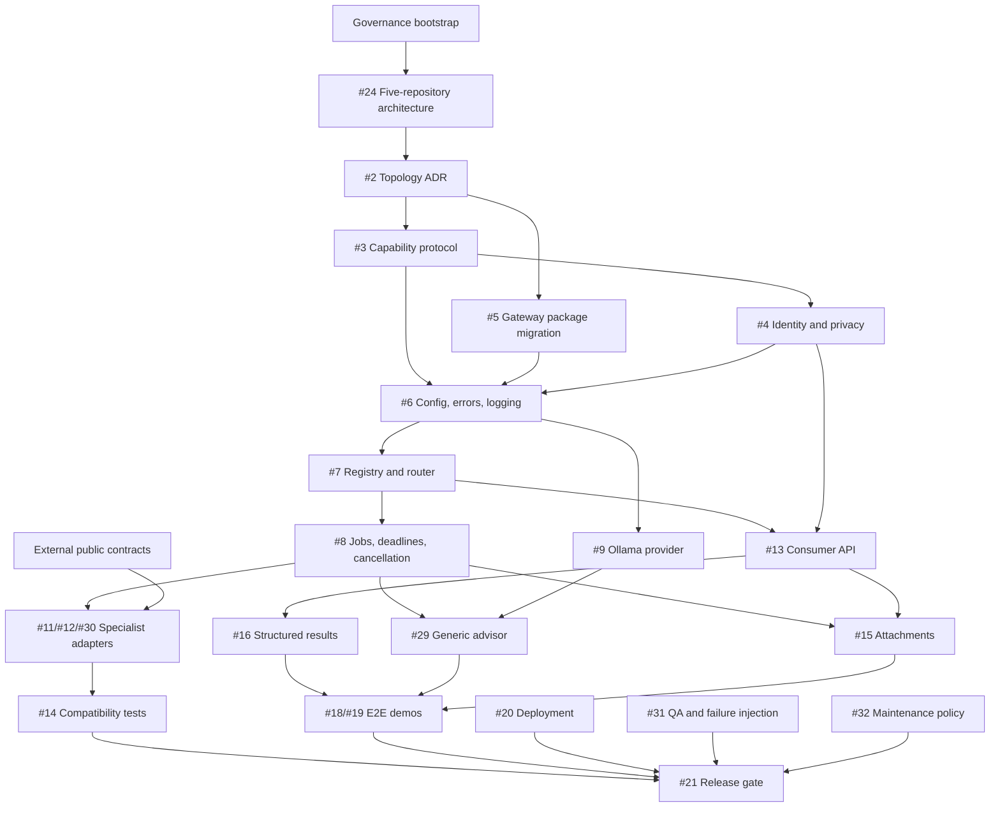

# Open-Issue Dependency Graph

Snapshot date: 2026-07-15

Scope: all 26 open issues in `Dyu20705/chat-assistant`, plus direct cross-repository blockers. The checked-in backlog manifests, current issue bodies, all open-issue comments, related producer/consumer issues, source tree, and recent merged PRs were reconciled. A dependency marked **inferred** is required by current architecture or acceptance criteria but is missing from the managed issue block and should be added during refinement.

## Execution graph

| Issue | Type | Depends on | Blocked by current evidence | Responsible repository | Risk | Proposed order/state |
| --- | --- | --- | --- | --- | --- | --- |
| [#24](https://github.com/Dyu20705/chat-assistant/issues/24) Add Health Assistant to architecture | Architecture | Closed #1 ownership baseline | None for documentation; merge requires human architecture approval | `chat-assistant`, coordinated with all five repos | Critical | 1 — first product issue after governance bootstrap |
| [#2](https://github.com/Dyu20705/chat-assistant/issues/2) Select transport/topology | Architecture/ADR | #24 **inferred** | Five-repo architecture drift; topology unresolved; human approval | `chat-assistant` | Critical | 2 — refine, propose, wait for approval |
| [#3](https://github.com/Dyu20705/chat-assistant/issues/3) Versioned capability protocol | Public contract | #2, #24 **inferred** | #2 open; human public-schema approval | `chat-assistant`, fixtures consumed by all five repos | Critical | 3 |
| [#4](https://github.com/Dyu20705/chat-assistant/issues/4) Identity/privacy/data ownership | Security/contract | #2, #3, #24 **inferred** | #2 and #3 open; human security/privacy approval | All five repos; policy recorded in `chat-assistant` | Critical | 4 |
| [#5](https://github.com/Dyu20705/chat-assistant/issues/5) Remove Discord runtime and initialize gateway package | Refactor/implementation | #2, #24 **inferred** | #2 open; project foundation is only partially present | `chat-assistant` | High | 5 |
| [#10](https://github.com/Dyu20705/chat-assistant/issues/10) CI, test foundation, protocol fixtures | Test | #3, #5 | Protocol/package entry point absent; current CI is partial acceptance evidence | `chat-assistant` | High | 6 — refine remaining scope before code |
| [#6](https://github.com/Dyu20705/chat-assistant/issues/6) Configuration, errors, structured logging | Implementation/security | #3, #4, #5 | All dependencies open | `chat-assistant` | Critical | 7 |
| [#7](https://github.com/Dyu20705/chat-assistant/issues/7) Capability registry/router | Implementation | #3, #5, #6 | All dependencies open | `chat-assistant` | Critical | 8 |
| [#8](https://github.com/Dyu20705/chat-assistant/issues/8) Job lifecycle/back-pressure | Implementation/reliability | #3, #4, #6, #7 | All dependencies open | `chat-assistant` | Critical | 9 |
| [#9](https://github.com/Dyu20705/chat-assistant/issues/9) Ollama provider/dependency health | Implementation/provider | #2, #3, #5, #6 from original issue | Dependencies open; legacy direct client is the wrong boundary | `chat-assistant` | High | 10 |
| [#29](https://github.com/Dyu20705/chat-assistant/issues/29) Generic advisor chat | Implementation | #4, #7, #8, #9 **inferred** | Gateway core and provider absent | `chat-assistant` | High | 11 |
| [#13](https://github.com/Dyu20705/chat-assistant/issues/13) Stable Mama consumer API | Integration/public API | #2, #3, #4, #7; `my-discord-bot` #56 | Local dependencies open; bot issue #56 is itself waiting on #2-#4 | `chat-assistant` + `my-discord-bot` | Critical | 12 — co-design after #2-#4, then implement here |
| [#16](https://github.com/Dyu20705/chat-assistant/issues/16) Structured results/delivery metadata | Implementation/contract | #3, #13 | Dependencies open | `chat-assistant`; rendered by `my-discord-bot` | High | 13 |
| [#15](https://github.com/Dyu20705/chat-assistant/issues/15) Safe content/attachment staging | Security/implementation | #3, #4, #8, #13 | Dependencies open; human security/privacy approval before merge | `chat-assistant` + bot handoff contract | Critical | 14 |
| [#17](https://github.com/Dyu20705/chat-assistant/issues/17) Health/metrics/tracing/audit | Observability | #4, #6, #8, #13 from original issue | Orphaned from managed epic; overlaps #6/#9/#20 but metrics/tracing remain uncovered | `chat-assistant` | High | Refine now; implement after #13 |
| [#11](https://github.com/Dyu20705/chat-assistant/issues/11) Lang adapter | Integration | #3, #7, #8; `lang-assistant` #62 | Producer contract #62 is open | `chat-assistant` consumer; `lang-assistant` producer | High | 15a — blocked externally |
| [#12](https://github.com/Dyu20705/chat-assistant/issues/12) Game adapter | Integration | #3, #7, #8; `game-assistant` #46 | Producer contract #46 is open | `chat-assistant` consumer; `game-assistant` producer | High | 15b — blocked externally |
| [#30](https://github.com/Dyu20705/chat-assistant/issues/30) Health adapter | Integration/safety | #3, #7, #8; `health-assistant` #21 | Health contract #21 is blocked by intended-use, hazard, privacy, and evidence decisions | `chat-assistant` consumer; `health-assistant` producer | Critical | 15c — blocked externally; human safety gate |
| [#14](https://github.com/Dyu20705/chat-assistant/issues/14) Cross-repo compatibility tests | Integration test | #3, #11, #12, #13, #30; all producer contracts | Adapters and public fixtures absent | `chat-assistant`, with all producer/consumer repos | Critical | 16 |
| [#20](https://github.com/Dyu20705/chat-assistant/issues/20) Reproducible deployment/operations | Deployment | #2, #5, #6, #8, #9, #13, #17 **partly inferred** | Service/package/API absent; human deployment approval | `chat-assistant`, coordinated with deployed repos | Critical | 17 |
| [#31](https://github.com/Dyu20705/chat-assistant/issues/31) Load/failure/privacy/safety evaluation | QA | #8-#17, #20, #29, #30 **inferred by scope** | Managed body declares no dependencies despite release-candidate scope | `chat-assistant` with synthetic cross-repo fixtures | Critical | 18 — refine before scheduling |
| [#18](https://github.com/Dyu20705/chat-assistant/issues/18) Generic/language end-to-end demo | QA/demo | #11, #13, #16, #29 **inferred**; `my-discord-bot` #56 and downstream client/workflow | Gateway, bot client, generic capability, and language contract absent | `chat-assistant`, `my-discord-bot`, `lang-assistant` | High | 19a — cross-repo blocked |
| [#19](https://github.com/Dyu20705/chat-assistant/issues/19) Game end-to-end demo | QA/demo | #12, #13, #15, #16; `my-discord-bot` #56 and downstream client/workflow | Gateway, bot client, game contract, and attachment path absent | `chat-assistant`, `my-discord-bot`, `game-assistant` | High | 19b — cross-repo blocked |
| [#32](https://github.com/Dyu20705/chat-assistant/issues/32) Upgrade/incident/deprecation policy | Maintenance | #3, #4 and accepted adapter/API compatibility windows **inferred** | Contract and operational behavior undecided | `chat-assistant`, coordinated with all consumers/producers | High | 20 |
| [#21](https://github.com/Dyu20705/chat-assistant/issues/21) Five-repo release gate | Release | #14, #18, #19, #20, #31, #32 **partly inferred**; corresponding external release gates | All release evidence absent; health may remain disabled; human approval mandatory | All five repositories | Critical | 21 — final gate only |
| [#33](https://github.com/Dyu20705/chat-assistant/issues/33) Quân Sư epic | Epic/coordination | Every managed child issue and related repository epic | Entire roadmap; checklist omits open #17 and #24 | `chat-assistant`, coordinated across five repos | Critical | Coordination only; close last |

## Direct external blockers

| Boundary | Producer/consumer issue | State | Consequence |
| --- | --- | --- | --- |
| Discord consumer design | [`my-discord-bot#56`](https://github.com/Dyu20705/my-discord-bot/issues/56) | Open; blocked on chat-assistant #2-#4 | #13 must be co-designed after the gateway decisions; issue text contains stale rename aliases |
| Language producer contract | [`lang-assistant#62`](https://github.com/Dyu20705/lang-assistant/issues/62) | Open, ready for agent | #11 cannot implement against private modules or storage |
| Game producer contract | [`game-assistant#46`](https://github.com/Dyu20705/game-assistant/issues/46) | Open, ready for agent | #12 cannot implement against private parsers, modules, or storage |
| Health producer contract | [`health-assistant#21`](https://github.com/Dyu20705/health-assistant/issues/21) | Open, blocked | #30 remains blocked until intended-use, hazard, privacy, and evidence decisions are approved |
| Health ecosystem integration | [`health-assistant#18`](https://github.com/Dyu20705/health-assistant/issues/18) | Open, blocked on chat-assistant #2-#4 | Cross-repo implementation must not begin before upstream architecture gates |

## Dependency shape

## Refinement required before implementation

1. Reconcile #24 and #2 with the canonical five-repository architecture and choose one specialist adapter topology using only committed or publicly linked review evidence.
2. Add #17 and #24 to the managed roadmap or explicitly close them with evidence. Issue #17 should retain only observability work not already owned by #6, #9, or #20.
3. Update #5, #9, and #10 to distinguish existing legacy/partial foundations from target gateway acceptance criteria.
4. Add missing dependency edges to #18-#21, #29, #31, and #32; normalize contradictory blocked/ready labels.
5. Break the apparent #13 / `my-discord-bot#56` coordination cycle: #2-#4 decide shared boundaries, then #56 finalizes the consumer design, then #13 implements the server contract.
6. Treat the health path as optional for the first generic/language/game release unless the separate human safety gate approves enabling it.

Until those refinements are applied, the next production issue is #24, not a feature implementation issue.
